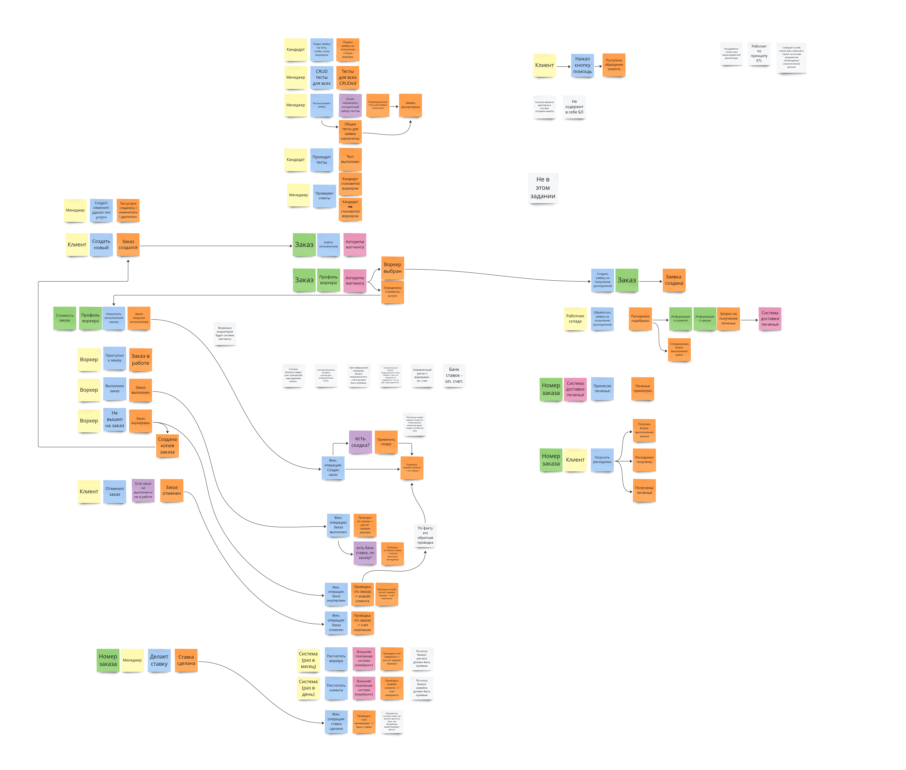
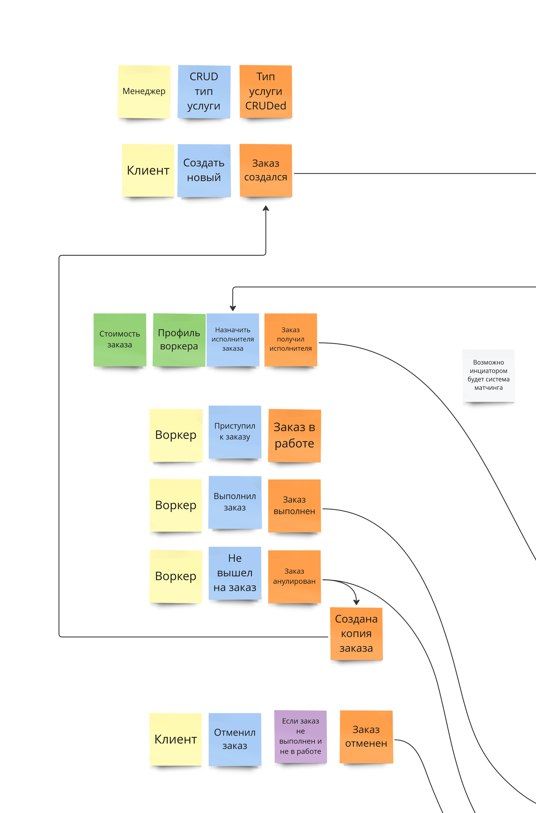
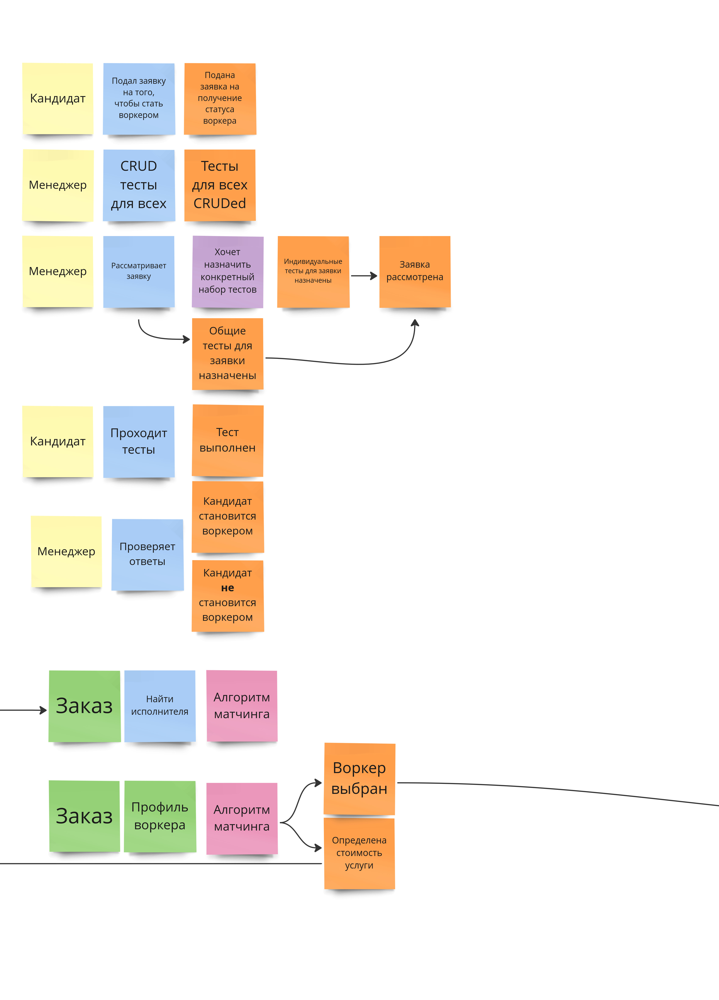
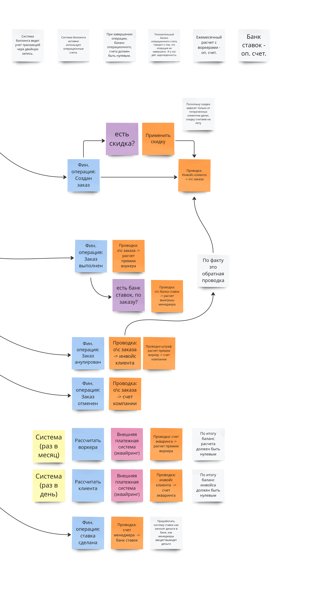
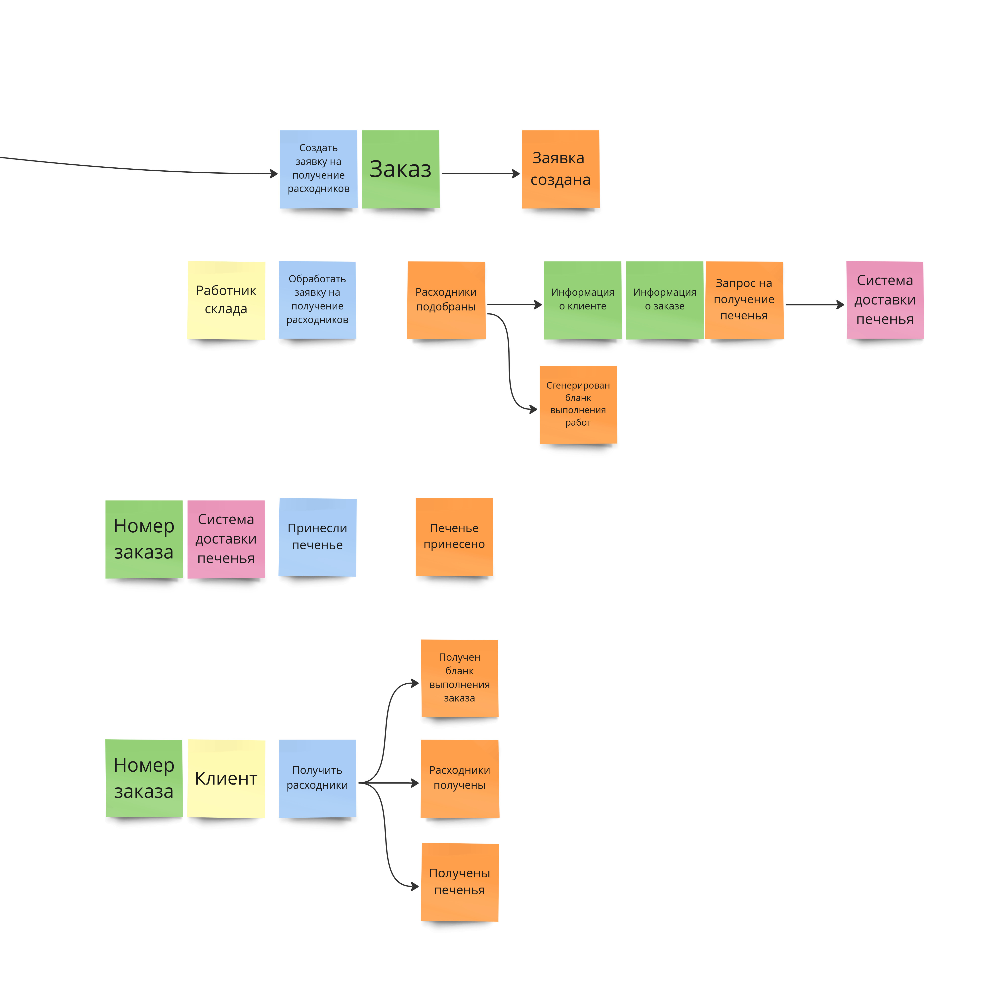

# Общая картина

Чтобы понять как система работает, удобно исходить из основного флоу, главной клиентской тропы. Обычно требования все в куче. Удобнее все разбивать исходя из этапов:

- Кот делает заказ
- Назначили воркера
- Получили материалы
- Передали денег

Отсюда сразу намечаются 4 системы - заказы, работа с воркерами,  склад, биллинг. Это использую как скелет для всей остальной архитектуры.




## Orders


Корневой домен. Содержит информацию о заявках, является окестратором остальных сервисов. В основе лежит сущность **Заказ**. Сага кажется тут оверхедом, используем стейт машину.

Основной Сущностью будет являться заказ:

```sql
table 'orders':
	- uid (uuid)
	- title (string) # Надо же как-то визуально отличать их
	- state (string) # Лучше enum т.к. при добавлении нового 
					 # статуса, не придеться лочить таблицу
	- client_uid    (uuid)
	- worker_uid    (uuid)
	- ordr_type_uid (uuid)
	- executed_id   (datetime range) # Время в которое должен быть выполнен заказ
	- price_fractional (int)         # Сумма в копейках
	- price_currency   (string)
	- timestapms     # created_at, updated_at
```

Вспомогательной будет order_types. В целом конечно можно обойтись без нее, но чуствую будут измнения в логике системы, в зависимости от типа, и тут возможно хранение каких-то параметров.

```sql
table 'order_type':
	- uid        (uuid)
	- title      (string)
	- timestapms        # created_at, updated_at
	- created_by (uuid) # manager uid
```

Таблица воркера, и клиента нам не нужны. Мы просто используем их uuid. Часть данных попадает через комманды, остальное из JWT запросов от системы авторизации.

---
Возможно нам понадобится что-то вроде лога, измнения статуса конкретного логгера.

```
order_1 created  cat#! 2023-06-01 12:00:01
order_1 assigned cat#2 2023-06-01 12:00:01
order_1 canceled cat#1 2023-06-01 12:00:01
```

Но такю штуку есть смысл выносить в систему аналитики, которую делать еще рано.

## WorkerSpace

Тут на самом деле 2 субдомена, под одним знаменателем. Система тестирования воркеров, и система подбора исполнителя.

Система тестирования кажется очень изолированной. Результатом ее работы будет список воркеров. Но этот список нужен только для подбора воркера под конкретный заказ.

Итак основной таблицей у нас есть список воркеров. 

```sql
table 'workers':
	- uid (uuid)
	- name (string) # Для удобства клиентов
	                # неплохо бы иметь человекочитаемое имя.
```

Она будет расширяться.

Так же у нас есть список заявок, на получение стауса воркера. Можем избавиться от преидущей таблициы через `SELECT uid, name FROM worker_job_applications WHERE review_state = apply` Причем можем сделать этот через SQL VIEW но это надо с командой разработки обсуждать.

```sql
table 'worker_job_applications':
	- uid
	- name
	- reviewd_by    # manager uid
	- reviewed_at   # datetime
	- review_state  # apply \ reject
	- test_uid
	- anwer_uid
```

Таблица с воспросами

```sql
table 'questions':
	- uid
	- # Вот тут надо смотреть на несколько тестов, чтобы принять решение
	  # делать это через JSON или через обычную реалиционку

table 'answeers':
	- uid
	- # Вот тут надо смотреть на несколько тестов, 
	  # делать это через JSON или через обычную реалиционку

```

## Biling 

Хрнаит в себе атомарные фин. транзакции, через двойную запись дебитор-кредитор, суммы положительные, деньги, чере Value Object.


Важные моменты связанны с операционными счетами. Все оформляем как проводки, нам хватит одной таблицы:

```sql
table 'entiries': 
	- uid (uuid)
	- transaction_uid (uuid)
	- creditor_type (string) # В целом поле необязательное, комментирует данные
	- creditor_uid (uuid)
	- debtor_type (string)
	- amount_frational (int) # В копейках
	- amount_currency (string)
	- comment (string) # В целом поле необязательное, комментирует данные
	- executed_at (datetime)
```

Одномоментные проводки группируюется по uid транзакции.

```yaml
Order is create:
  Worker award:
    uid: "1234-..."
    transaction_uid: "0001-..." # Совпадает
    creditor_type: "client"
    creditor_uid "2134-.."      # Client uid
    debtor_type: "order"
    debrtor_uid "2134-.."       # Order uid
    amount_fractional: 10000    # 100.00 Котоедениц
    amount_currency: 'CAT' 
    comment: "Списываем с клиента сумму на выполнение заказа"
  Discount:
    uid: "1234-..."
    transaction_uid: "0001-..." # Совпадает
    creditor_type: "order"
    creditor_uid "213-.."       # Order uid
    debtor_type: "client"
    debrtor_uid "2134-.."       # Clinet uid
    amount_fractional: 1000     # 10.00 Котоедениц
    amount_currency: 'CAT' 
    comment: "Скидка по закзу `231...`"
```

## Warehouse

Основное с чем приходится работать, это с заяками на подбок инструментов


```sql
table 'warehouse_order':
	- uid
	- worder_uid
	- order_uid
	- storekeeper_uid
	- state 
	- timespamps
```


## Analyst

Пока в процессе разработки, работает как ETL

## Betting

Серрвис для ставок менеджеров на те или иные заказы. Пока в процессе разработки.

## Accounts 

Не реализуем, но предположу, что будет вышлядеть так:

Для управления аккаутами, авторизацией и аутендитификацей и управления ролями.

В системе сейчас обозначенно ряд ролей. 

- **Клиента** (Роль получается автоматически после регистрации)
- **Воркер** (Роль просле тестирования)
- **Админстратор** (Роль назначется разработчиком)
- **Менеджер** (Роль назначается администратором)
- **Закупщик** (Роль назначается администратором)
- **Контролер** (Роль назначается администратором)

Accounts Хранит в JWT токене базовую информацию в аккаунте пользователя. ACL не реализуем, для скорости реализации.
