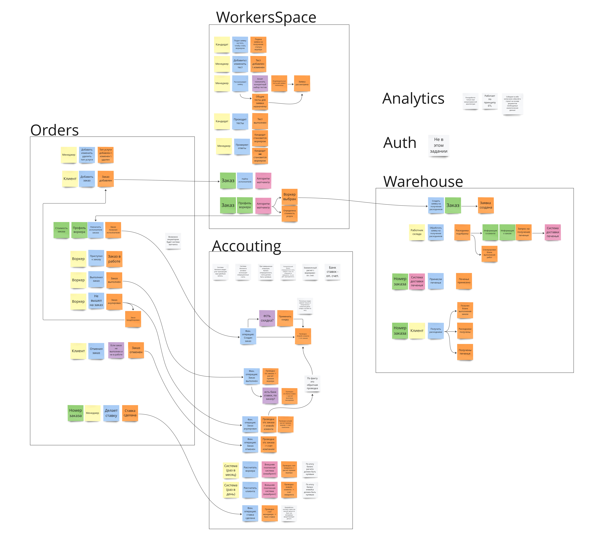

Мы предоставляем услуги. Рынок услуг, особенно бытовых - высококонкурентен. Сложно создать услугу которую нельзя скопировать. Конкуренты также могут демпенгануть по цене, так что ценовую политику тоже нельзя назвать приемуществом.

Но качество сервиса, то как мы относимся к нашим клиентам, как мы удовалетвореям их потребности скопировать сложно.

Мы работаем только с самыми лучшими воркерами, и для каждого вашего заказа мы подберем наиболее подходящего из них. 

**WorkerShop** - CoreDomain, его предметная область, это нахождение (тестирование) и подбор воркера для конкретного заказа.

**Orders** - Содержит информацию о заявках, является оркестратором остальных сервисов. В основе лежит сущность **Заказ**.

Тут же обрабатываются ставки на заказы. 

**Accouting** - Общая фин. отчетность. Позволяет централизировано отделу финансов, смотреть анализировать все фин. операции.

**Warehouse** - Основное с чем приходится работать, это с заявками на подбор инструментов

**Auth** - Авторизация и аутентификация.

**Analyse** - Сводная аналитика по всей компании, нужна для принятия руководящих решений.

Немного разъясню свою позицию относительно почему схема выглядит данным образом:
- **WorkerShop** является главным поддоменом, о этом указанно выше
- **Orders** - является оркестратором, связующим поддоменом, но его сложно назвать уникальным для бизнеса
- Остальные поддомены, по факту можно заменить на внешние продукты:
	- **Auth** - AWS IAM
	- **Warehouse** - 1c склад
	- **Analytics** - Metabase
- **Accouting** - тут конечно напрашивается замена на 1с, но если вспомнить про неявные требования, что у нас как и воркер так и исполнитель, точно хотят знать свой баланс. Так что явно должна быть связка с 1С, т.к. у нас в компании должны быть внесистемные выплаты, зарплата менеджерам, например. Но первичку мы также храним внутри своей экосистемы.

Представим карту контекстов.

Хотя в требованиях мало что было сказано про аналитику, без бизнес-метрик, мы не сможем адекватно оценивать успешность той или иной гипотезы. Это ключевой инструмент для принятия дальнейших решений.

**ES диаграмма** потерпела небольшие изменения, betting ушел в заказы, billing переименован в accouting, удалил технический поддомен по нотификациям.

Несмотря на то, что в карте контекстов было много уделено аналитики отражения на ES диаграмме оно не нашло из-за недостатка требований. Нужно будет с бизнесом проговорить этот важный вопрос.

**Модель данных**:

Выбор архитектуры, я не вижу не одной бизнес потребности, связанной с высокой нагрузкой, и реальными потребностями в горизонтальном масштабировании. Поэтому дальнейший подход выделения микросервисов, основан прежде всего на связанности межу компонентами.

Я бы выбрал смешанный подход между modular монолитом, service-based и микросервисной архитектурой.

То, что точно можно легко выделить, убираем в микросервис. 

То где связанность высокая, но хочется разделить, убираем service-based, потом или соединим, или разъединим, через несколько итераций. Тут создаем искусственные ограничения.

А, там где связанность низкая, на одной сущности, убираем в модули. Это всего будет легко разделить, но сейчас мы сэкономим кучу средств.

